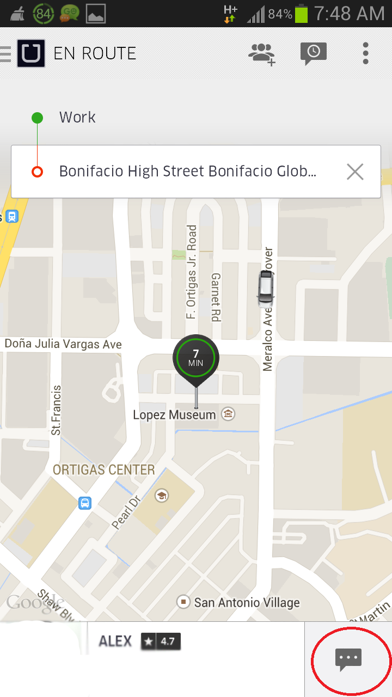
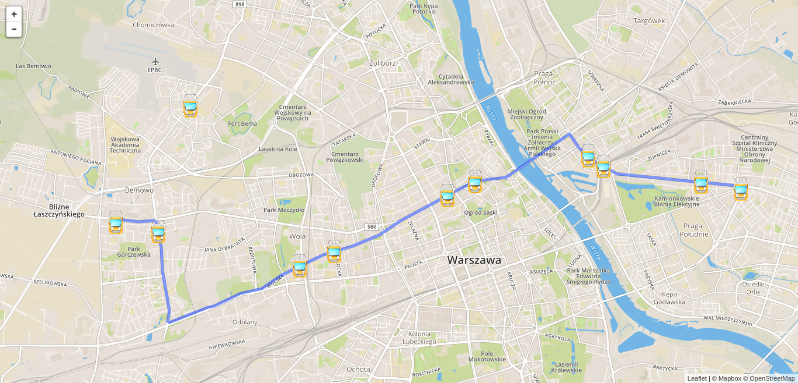

## Problem i pomysł

<div class="columns-2">
Rozkłady jazdy bywają zawodne

* korki
* niespodziewane utrudnienia
* co gdy odjedzie przed czasem?
* czemu czekam tak długo? czy czekać dalej?


</div>

## api.um.warszawa.pl

<iframe src="https://api.um.warszawa.pl/#"></iframe>

## Jak wygląda API

```
{"result":[
  {"Status":"RUNNING","FirstLine":"6  ","Lon":21.0523891,"Lines":"6,31           ",
    "Time":"2016-04-14T12:05:29","Lat":52.2473335,"LowFloor":false,"Brigade":"72  "},
  {"Status":"RUNNING","FirstLine":"15 ","Lon":20.9652328,"Lines":"15             ",
    "Time":"2016-04-14T12:05:27","Lat":52.198101,"LowFloor":false,"Brigade":"4   "},
  {"Status":"RUNNING","FirstLine":"31 ","Lon":21.0245934,"Lines":"31             ",
   "Time":"2016-04-14T12:05:28","Lat":52.1894722,"LowFloor":false,"Brigade":"5   "},
  {"Status":"RUNNING","FirstLine":"27 ","Lon":20.9310055,"Lines":"27             ",
    "Time":"2016-04-14T12:05:26","Lat":52.2248306,"LowFloor":false,"Brigade":"3   "},
  {"Status":"RUNNING","FirstLine":"28 ","Lon":20.9249058,"Lines":"28             ",
    "Time":"2016-04-14T12:05:27","Lat":52.2612,"LowFloor":false,"Brigade":"10  "},
  {"Status":"RUNNING","FirstLine":"28 ","Lon":21.036026,"Lines":"28             ",
   "Time":"2016-04-14T12:04:05","Lat":52.2533607,"LowFloor":false,"Brigade":"1   "},
  {"Status":"RUNNING","FirstLine":"23 ","Lon":20.9230213,"Lines":"23             ",
    "Time":"2016-04-14T12:05:29","Lat":52.259594,"LowFloor":false,"Brigade":"2   "},
  {"Status":"RUNNING","FirstLine":"22 ","Lon":21.0127277,"Lines":"22     ",
   "Time":"2016-04-14T12:05:30","Lat":52.230011,"LowFloor":false,"Brigade":"6   "},
...
```

## Podstawowe statystyki

TODO: tabelka z csv

## Ile jest pojazdów?

TODO: wizualizacja (stacked barchart nisko/wysokopodłogowe vs nr linii)

## Wizualizacja pozycji tramwajów

```{r, include=F}
library(leaflet)
library(rgdal)

data <- read.csv2("code/data/mapa-kryminalna-districts.csv")
warsaw <- readOGR("code/geojson/warsaw-districts.geojson", "OGRGeoJSON")
```

```{r, echo=F, message=F, warning=F, error=F, results = 'asis'}
pal <- colorQuantile("YlGn", NULL, n = 5)
leaflet(data) %>% 
  # Base groups
  addProviderTiles("CartoDB.Positron", group = "CartoDB") %>%
  addProviderTiles("Stamen.TonerLite", group = "Toner Lite") %>%
  addTiles(group = "OSM") %>%
  # Markers
  addMarkers(~MappedLongitude, ~MappedLatitude, popup = ~as.character(district),
    clusterOptions = markerClusterOptions(),
    group = "Clusters"
  ) %>%
  addPolygons(data = warsaw,
              stroke = T,
              fillOpacity = 0.05,
              color = "#000000", 
              weight = 1,
              group = "Borders") %>%
  # Layers control
  addLayersControl(
    baseGroups = c("CartoDB", "Toner Lite", "OSM"),
    overlayGroups = c("Clusters", "Borders"),
    options = layersControlOptions(collapsed = FALSE)
  )
```


## GeoJSON

<http://geojson.io>

## Wyzwania

TODO: Jak budowana była aplikacja


## Demo MVP

<center>

</center>
